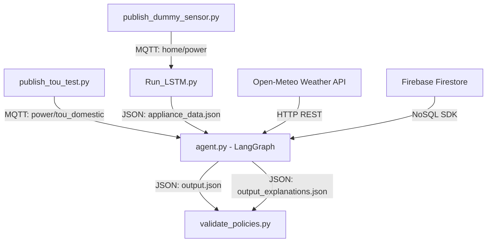

# AI-Based Optimized Energy Utilization System Using Edge Controllers

This repository implements a **two-level, capacity-constrained home energy management system (HEMS)** designed to run on resource-constrained edge controllers. The system shifts flexible household loads dynamically based on Time-of-Use (TOU) tariffs, hourly grid capacity limits, localized weather metrics, and user preferences.

---

## Research Orientation & Problem Statement

### 1. The Traditional Heuristic Approach (Wrong Orientation)
Most HEMS implementations treat energy management as a binary **peak-avoidance relabeling problem**. They label hours as either "peak" or "off-peak", predicting appliance usage patterns and simply shifting all flexible loads out of peak hours. This lacks a **power budget ceiling**, causing synchronization peaks where multiple shifted appliances run simultaneously off-peak, exceeding grid distribution transformer limits.

### 2. Two-Level Capacity-Constrained Scheduling (Correct Orientation)
This system models HEMS as a capacity-constrained bin-packing problem:
1. **High-Level Forecasting Layer**: Keeps forecasting each appliance *separately* (preserving individual demand signatures) and derives the household's *aggregate* power consumption by summing the per-appliance forecasts.
2. **Available-Capacity Layer**: Determines how much *additional* power capacity is available for flexible/schedulable appliances in each time slot based on utility-published grid capacity ceilings.
3. **Allocation Layer**: Solves a capacity-constrained bin-packing optimization problem, scheduling appliances into slots such that the sum of power drawn never exceeds the available capacity, while minimizing cost and respecting comfort constraints.

---

## System Architecture

The project consists of three core components communicating via JSON file outputs and MQTT events:



---

## Component Details

### 1. Scraper & Capacity Publisher (`publish_tou_test.py`)
Scrapes the utility's (LECO) Time-of-Use tariff page to parse Day/Peak/Off-peak prices and time ranges. Since utility pages do not publish dynamic grid capacity limits, the script appends a configurable capacity ceiling (in kW) for each window:
* **Day**: 3.5 kW
* **Peak**: 1.5 kW
* **Off-Peak**: 5.0 kW

### 2. LSTM Forecasting Layer (`Run_LSTM.py`)
Loads a pre-trained LSTM model to predict the next 24 hours of continuous power consumption for five household appliances (Washing Machine, Heater, AC, Vehicle Charger, Vacuum Cleaner).
* **Aggregate Forecast**: Computes the sum of predicted appliance averages to provide baseline total household power.
* **Outputs**: Writes everything to [appliance_data.json](file:///c:/Users/pankaja/Desktop/Research/AI-Based-Optimized-Energy-Utilization-system-Using-Edge-Controllers/appliance_data.json) and [aggregate_power_forecast.json](file:///c:/Users/pankaja/Desktop/Research/AI-Based-Optimized-Energy-Utilization-system-Using-Edge-Controllers/aggregate_power_forecast.json).

### 3. LangGraph Decision Agent (`agent.py`)
Rebuilt as a LangGraph tool-based agent using `StateGraph`. The control flow consists of the following nodes:
- `fetch_data`: Collects forecasts, weather, and MQTT TOU payloads.
- `parse_preferences`: Translates natural-language Firestore instructions into structured boolean arrays (via Ollama).
- `schedule_allocation`: Executes the deterministic capacity-constrained greedy algorithm.
- `write_results`: Writes final files and updates Firestore.
- `fallback_revert`: Captures errors (e.g. MQTT or LLM timeout) and falls back safely to original predicted states.

#### The Allocation Algorithm
1. **Prioritization**: Comfort-critical (`AC_Power`, `Heater_Power`) and constrained appliances are sorted first.
2. **Cost-Comfort Scoring**: Slots are scored by electricity price adjusted by localized weather parameters (e.g., cooling load is rewarded with $-100$ score bonus in hot hours $\ge 28^{\circ}$C).
3. **Greedy Placement**: Places appliance demands in the lowest-scored slots where remaining capacity fits the appliance's rating. If capacity is exhausted, a soft-fallback pass places the remaining runtime in slots with the highest remaining capacity.

### 4. Policy-Based Validation Layer (`validate_policies.py`)
A standalone auditor script that verifies scheduler outputs.
- **Stage 1 (Policy Generation)**: Calls the LLM to generate approximately 100 distinct policies across capacity, cost, preference, weather, robustness, and format categories.
- **Stage 2 (Auditing)**: Uses programmatic code assertions (e.g., format validations, capacity bounds checks) and LLM evaluations to verify the output and outputs a detailed pass/fail report to [validation_report.json](file:///c:/Users/pankaja/Desktop/Research/AI-Based-Optimized-Energy-Utilization-system-Using-Edge-Controllers/validation_report.json).

---

## File Schemas

### `appliance_data.json`
```json
{
  "WashingMachine_Power": {
    "states": [0, 0, 1, ...],
    "averages": [113.57, 187.14, ...],
    "binary_average_states": [0, 0, 1, ...]
  },
  "aggregate_forecast": [619.15, 1029.19, ...]
}
```

### `output.json`
```json
{
  "WashingMachine_Power": [1, 1, 1, 1, 1, 0, ...],
  "Heater_Power": [1, 1, 1, 1, 1, 1, ...]
}
```

### `output_explanations.json`
```json
{
  "per_appliance": {
    "WashingMachine_Power": {
      "original_cost": 232.80,
      "optimized_cost": 138.60,
      "savings": 94.20,
      "reasons": [
        "Moved 09:00 → 00:00 to a cheaper band (day->off_peak)."
      ]
    }
  },
  "totals": {
    "baseline": 2485.40,
    "optimized": 1857.00,
    "savings": 628.40,
    "percent_savings": 25.28
  }
}
```

---

## Getting Started

### 1. Installation
Install dependencies in the virtual environment:
```bash
wsl .venv/bin/pip install -r requirements.txt
```

### 2. Execution
Start the MQTT publishers, LSTM forecasting, and the LangGraph agent:
```bash
# Run LSTM predictions
wsl .venv/bin/python src/predictor/Run_LSTM.py

# Run TOU publisher
wsl .venv/bin/python src/mqtt/publish_tou_test.py

# Execute Decision Agent Once
wsl .venv/bin/python -u -c "import sys; sys.path.insert(0, 'src'); from agent.agent import main_once; main_once()"

# Run Standalone Validation Script
wsl .venv/bin/python src/agent/validate_policies.py
```
