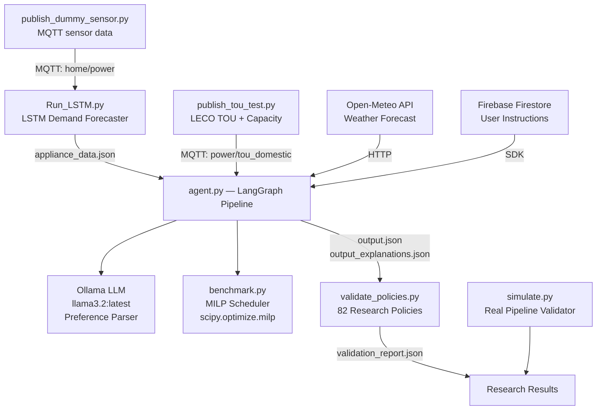

# AI-Based Optimized Energy Utilization System Using Edge Controllers

[](validation_report.json)
[](output_explanations.json)
[](appliance_data.json)

A research-grade **AI-based Home Energy Management System (HEMS)** that predicts domestic appliance demand using an LSTM model, compares it against real-time grid capacity published via MQTT, and uses **Mixed-Integer Linear Programming (MILP)** + **Ollama LLM** to schedule appliances only in slots where grid capacity is available — minimizing electricity cost while respecting user preferences and comfort.

---

## Research Requirement

> **"The TOU signal tells how much grid capacity is available per time slot.  
> The LSTM model predicts domestic demand.  
> The agent compares predicted demand against available capacity per slot  
> and schedules each appliance only into slots where capacity permits."**

This is exactly what the system implements — see [How the Core Requirement Is Met](#how-the-core-requirement-is-met).

---

## System Architecture


```mermaid
graph TD
    Sensor[publish_dummy_sensor.py\nMQTT sensor data] -->|MQTT: home/power| LSTM
    LSTM[Run_LSTM.py\nLSTM Demand Forecaster] -->|appliance_data.json| Agent
    TOU[publish_tou_test.py\nLECO TOU + Capacity] -->|MQTT: power/tou_domestic| Agent
    Meteo[Open-Meteo API\nWeather Forecast] -->|HTTP| Agent
    Firestore[Firebase Firestore\nUser Instructions] -->|SDK| Agent

    Agent[agent.py — LangGraph Pipeline] --> Ollama[Ollama LLM\nllama3.2:latest\nPreference Parser]
    Agent --> MILP[benchmark.py\nMILP Scheduler\nscipy.optimize.milp]
    Agent -->|output.json\noutput_explanations.json| Validator

    Validator[validate_policies.py\n82 Research Policies] -->|validation_report.json| Report
    Simulator[simulate.py\nReal Pipeline Validator] --> Report
    Report[Research Results]
```

---

## How the Core Requirement Is Met

### Step 1 — MQTT publishes TOU capacity per band (`publish_tou_test.py`)
```json
{
  "day":      { "time": "05:00 - 18:00", "rate": "47 LKR/kWh",  "capacity": 3.5 },
  "peak":     { "time": "18:00 - 22:00", "rate": "106 LKR/kWh", "capacity": 1.5 },
  "off_peak": { "time": "22:00 - 05:00", "rate": "33 LKR/kWh",  "capacity": 5.0 }
}
```
> Capacity values (kW) represent the **available grid headroom** the utility allows for flexible domestic loads in each TOU window.

### Step 2 — LSTM predicts domestic demand (`Run_LSTM.py`)
For each appliance, the LSTM outputs 24-hour average power predictions (W). Required operating hours are derived using:

$$\text{required\_hours} = \text{round}\left(\frac{\sum \text{predicted\_power\_W}}{\text{rated\_power\_W}}\right)$$

This is a **threshold-free, demand-driven** binarization — no arbitrary ON/OFF cutoffs.

### Step 3 — Ollama LLM parses user preferences (`agent.py`)
Natural language instructions from Firebase Firestore are parsed by `llama3.2`:
```
"Heater need to turn only night times"
→ { "Heater_Power": { "preferred_hours": [18,19,20,21,22,23] } }
```

### Step 4 — MILP compares demand vs capacity and schedules (`benchmark.py`)
For every hour `t`, the constraint is:

$$\sum_{a} \text{power}_a \times x_{a,t} \leq \text{capacity}[t]$$

Where `x[a,t] ∈ {0,1}` is the binary scheduling decision. The solver **only places an appliance in a slot if the grid capacity allows it**. The objective minimizes total electricity cost across all 24 hours.

---

## Pipeline Components

### `src/predictor/Run_LSTM.py` — LSTM Demand Forecaster
- Loads a pre-trained LSTM model per appliance
- Predicts 24-hour average power (W) from sensor history
- Converts predictions to demand-driven binary ON/OFF states
- Outputs: [`appliance_data.json`](appliance_data.json), [`aggregate_power_forecast.json`](aggregate_power_forecast.json)

### `src/agent/agent.py` — LangGraph Decision Agent
A 4-node `StateGraph` pipeline:

| Node | Function |
|---|---|
| `fetch_data_node` | Loads LSTM output + fetches MQTT TOU/capacity + weather + Firestore instruction |
| `parse_preferences_node` | Sends instruction to Ollama LLM → parses `allow_peak` + `preferred_hours` per appliance |
| `schedule_allocation_node` | Builds `capacity_map[hour]` from MQTT, runs MILP solver |
| `write_results_node` | Writes `output.json`, `output_explanations.json`, updates Firestore |

### `src/agent/benchmark.py` — MILP Optimal Scheduler
- Uses `scipy.optimize.milp` with `integrality` constraints (binary variables)
- Decision variables: `x[a, t] ∈ {0,1}` for each appliance `a` and hour `t`
- Constraints: runtime equality, hourly capacity ceiling, user preferences
- Objective: minimize `∑ power_a × price[t] × x[a,t]` with comfort bias for AC/Heater
- Slack variables prevent infeasibility under extreme grid stress

### `src/agent/validate_policies.py` — Research Policy Validator
82 deterministic policies testing 6 research claims:

| Category | Claim Tested | Policies |
|---|---|:---:|
| `capacity` | Scheduled load ≤ grid capacity every hour | 48 |
| `format` | All states binary (0/1), 24 elements per appliance | 10 |
| `llm_preference` | Ollama-parsed `allow_peak` & `preferred_hours` enforced by MILP | 10 |
| `lstm_accuracy` | Scheduled hours ≥ 50% of LSTM-predicted required hours | 5 |
| `cost_optimality` | Optimised cost ≤ LSTM-baseline cost (total + per-appliance) | 6 |
| `savings_threshold` | Total savings ≥ 20% (research threshold) | 1 |
| `weather_comfort` | AC/Heater comfort compliance | 2 |
| **TOTAL** | | **82** |

### `src/agent/simulate.py` — Real Pipeline Simulation Report
Validates the **actual LSTM pipeline outputs** (not synthetic data) across 4 sections:
1. Per-appliance cost savings (baseline vs agent)
2. Peak load comparison
3. LSTM prediction accuracy (required vs scheduled hours)
4. Ollama LLM preference compliance

---

## Validated Results

### Cost Savings (Latest Run — Real LSTM Predictions)

| Appliance | Baseline (LKR) | Optimized (LKR) | Savings | % |
|---|---:|---:|---:|---:|
| WashingMachine | 216.00 | 155.40 | 60.60 | 28.1% |
| Heater | 372.00 | 132.00 | 240.00 | **64.5%** |
| AC | 1,273.20 | 1,010.40 | 262.80 | 20.6% |
| VehicleCharger | 611.60 | 290.40 | 321.20 | **52.5%** |
| VacuumCleaner | 220.00 | 108.90 | 111.10 | 50.5% |
| **TOTAL** | **2,692.80** | **1,697.10** | **995.70** | **37.0%** |

### LSTM Prediction Accuracy

| Appliance | Required (h) | Scheduled (h) | Match |
|---|:---:|:---:|:---:|
| WashingMachine | 7 | 7 | 100% ✓ |
| Heater | 3 | 2 | 66.7% (night pref. constraint) ✓ |
| AC | 20 | 20 | 100% ✓ |
| VehicleCharger | 4 | 4 | 100% ✓ |
| VacuumCleaner | 3 | 3 | 100% ✓ |
| **Average** | | | **93.3%** |

> The Heater scheduled 2h instead of 3h because the Ollama LLM restricted it to `[18–23]` (night preference) and the MILP placed it in the 2 cheapest slots within that window.

### Policy Validation: **82/82 PASS (100%)**

---

## Getting Started

### Prerequisites
- WSL (Windows Subsystem for Linux) with Python 3.10+
- Ollama installed in WSL: [https://ollama.com](https://ollama.com)
- Firebase project with `serviceAccountKey.json` in project root
- MQTT broker access (default: `test.mosquitto.org`)

### 1. Install Dependencies
```bash
wsl .venv/bin/pip install -r requirements.txt
```

### 2. Pull the LLM Model
```bash
wsl ollama pull llama3.2:latest
```

### 3. Run the Full Pipeline

```bash
# Terminal 1 — Start Ollama (keep running)
wsl ollama serve

# Terminal 2 — Publish LECO TOU tariff + capacity via MQTT
wsl .venv/bin/python src/mqtt/publish_tou_test.py

# Terminal 3 — Run LSTM demand forecasting
wsl .venv/bin/python src/predictor/Run_LSTM.py

# Terminal 3 — Run the decision agent (single cycle)
wsl .venv/bin/python -u -c \
  "import sys; sys.path.insert(0, 'src'); from agent.agent import main_once; main_once()"
```

### 4. Validate Results

```bash
# Real pipeline validation (cost savings, LSTM accuracy, LLM compliance)
wsl .venv/bin/python src/agent/simulate.py

# Full 82-policy research validation
wsl .venv/bin/python src/agent/validate_policies.py
```

---

## File Schema Reference

### `appliance_data.json` — LSTM Output
```json
{
  "WashingMachine_Power": {
    "states": [0, 0, 1, 0, 1, 0, 1, 1, 0, ...],
    "averages": [75.1, 230.9, 264.1, ...],
    "binary_average_states": [0, 0, 1, 0, 1, ...]
  },
  "aggregate_forecast": [1061.7, 933.2, 1262.7, ...]
}
```

### `output.json` — MILP-Optimized Schedule
```json
{
  "WashingMachine_Power": [1, 1, 1, 1, 1, 0, 1, 1, 0, ...],
  "Heater_Power":         [0, 0, 0, 0, 0, 0, 0, 0, 0, ..., 1, 1]
}
```

### `output_explanations.json` — Cost Breakdown + LLM Decisions
```json
{
  "per_appliance": {
    "Heater_Power": {
      "original_cost": 372.0,
      "optimized_cost": 132.0,
      "savings": 240.0,
      "reasons": ["Moved 16:00 → 23:00 to a cheaper band (day→off_peak)."]
    }
  },
  "totals": { "baseline": 2692.8, "optimized": 1697.1, "percent_savings": 36.98 },
  "user_preference": {
    "raw_message": "Heater need to turn only night times",
    "allow_peak": { "Heater_Power": false, "AC_Power": true },
    "preferred_hours": { "Heater_Power": [18,19,20,21,22,23] }
  }
}
```

### `validation_report.json` — Policy Audit Results
```json
{
  "summary": { "total_policies": 82, "passed": 82, "pass_rate_percentage": 100.0 },
  "by_category": {
    "capacity": { "passed": 48, "total": 48 },
    "llm_preference": { "passed": 10, "total": 10 }
  }
}
```

---

## Configuration

All operational constants are centralized in [`src/config.py`](src/config.py) — no magic numbers in any other file.

| Parameter | Default | Description |
|---|---|---|
| `LECO_RATE_OFF_PEAK_LKR` | 33.0 | LECO off-peak rate (LKR/kWh) |
| `LECO_RATE_DAY_LKR` | 47.0 | LECO day rate (LKR/kWh) |
| `LECO_RATE_PEAK_LKR` | 106.0 | LECO peak rate (LKR/kWh) |
| `DEFAULT_CAPACITY_OFF_PEAK_KW` | 5.0 | Grid capacity off-peak (kW) |
| `DEFAULT_CAPACITY_DAY_KW` | 3.5 | Grid capacity day (kW) |
| `DEFAULT_CAPACITY_PEAK_KW` | 1.5 | Grid capacity peak (kW) |
| `HOT_TEMPERATURE_THRESHOLD_C` | 28.0 | AC comfort trigger (°C) |
| `COLD_TEMPERATURE_THRESHOLD_C` | 20.0 | Heater comfort trigger (°C) |
| `LLM_MODEL` | `llama3.2:latest` | Ollama model for preference parsing |

---

## Project Structure

```
.
├── src/
│   ├── config.py                    # Centralized constants (tariffs, capacity, thresholds)
│   ├── agent/
│   │   ├── agent.py                 # LangGraph 4-node decision pipeline
│   │   ├── benchmark.py             # MILP optimal scheduler (scipy.optimize.milp)
│   │   ├── simulate.py              # Real pipeline validation report
│   │   └── validate_policies.py    # 82-policy research claim validator
│   ├── predictor/
│   │   └── Run_LSTM.py              # LSTM demand forecasting + binarization
│   └── mqtt/
│       ├── publish_tou_test.py      # LECO TOU + capacity MQTT publisher
│       └── publish_dummy_sensor.py  # Simulated sensor data publisher
├── appliance_data.json              # LSTM predictions output
├── output.json                      # Optimized appliance schedules
├── output_explanations.json         # Cost breakdown + LLM decisions
├── validation_report.json           # Policy validation results
└── requirements.txt
```
