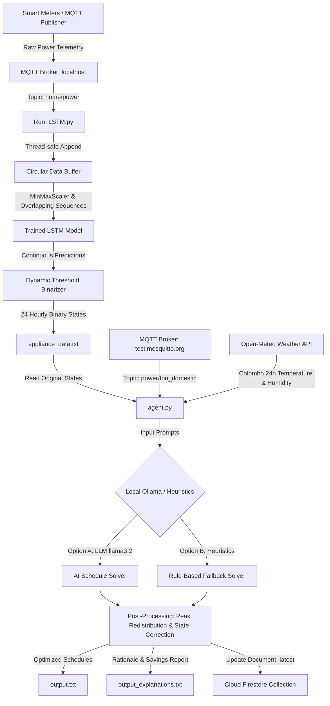

# AI-Based Optimized Energy Utilization System: System Code Analysis

This document provides a comprehensive, detailed analysis and line-by-line breakdown of the core component files for the Edge Controller Energy Optimizer:
1. **[agent.py](file:///c:/Users/pankaja/Desktop/Research/AI-Based-Optimized-Energy-Utilization-system-Using-Edge-Controllers/src/agent/agent.py)**: The optimization, weather integration, and orchestration agent.
2. **[Run_LSTM.py](file:///c:/Users/pankaja/Desktop/Research/AI-Based-Optimized-Energy-Utilization-system-Using-Edge-Controllers/src/predictor/Run_LSTM.py)**: The real-time telemetry processor and LSTM machine learning predictor.

---

## 1. System Architecture & Data Flow

To understand how these files collaborate, the diagram below illustrates the live data flow between the Edge Controller predictor and the optimization agent:



---

## 2. Comprehensive Code Walkthrough: `agent.py`

### File Overview
The Optimization Agent coordinates data from external interfaces (MQTT tariffs, open weather feeds) and runs optimization routines to lower home energy bills. It uses a combination of deep LLM prompt framing and hard constraint rule-checkers to ensure that the shifted load maintains structural validity.

> [!NOTE]
> The agent enforces constraints such that the total duration (number of active hours) of appliance operations remains identical to the user's predicted consumption profile, preventing the optimizer from simply turning off appliances permanently to save money.

### Line-by-Line Breakdown

| Line # | Code Symbol / Statement | Detailed Technical Explanation |
| :--- | :--- | :--- |
| **1** | `import paho.mqtt.client as mqtt` | Imports the Eclipse Paho MQTT client interface. This module manages network handshakes, topic subscriptions, and message-receiving loops for pulling Time-of-Use (TOU) tariffs. |
| **2** | `import time` | Provides clock time routines. Used to stall execution during MQTT connection waits (`time.sleep`) and control execution pacing. |
| **3** | `import ast` | Imports Python's Abstract Syntax Tree parser. The `ast.literal_eval` function is used to safely evaluate strings representing Python literal lists (such as LLM output arrays) without invoking the insecure `eval()` interpreter. |
| **4** | `import json` | Standard module for parsing raw strings into JSON objects and serialized key-value maps. |
| **5** | `from langchain_ollama import ChatOllama` | LangChain wrapper for Ollama. Simplifies communication with the local Ollama daemon container and enables model selection, token parameters, and prompt configurations. |
| **6** | `import ollama` | The native Ollama Python SDK, used to capture specific runtime exception structures (like `ResponseError`). |
| **7** | `from datetime import datetime, timedelta` | Core classes to handle absolute calendar timestamps and calculate relative offsets (like shifting intervals across midnight). |
| **8** | `import re` | Standard library regular expression parsing. Used to filter numeric content from pricing units and locate array indicators `[...]` inside noisy LLM outputs. |
| **9** | `from typing import Dict, List, Tuple` | Enhances readability and type validation for data mappings, array structures, and multi-value returns. |
| **10** | `import requests` | An HTTP library used to fetch Colombo weather statistics from the Open-Meteo forecast JSON web API. |
| **11** | `from datetime import datetime` | (Duplicate import statement) Safely ignored by Python compilers. |
| **12** | `import os` | Integrates with the host OS filesystem to resolve absolute paths relative to where the agent execution process is running. |
| **13** | `from zoneinfo import ZoneInfo` | Imports timezone database configurations to compute timezone offsets dynamically (specifically `"Asia/Colombo"`). |
| **15-20**| `MQTT_BROKER = ...` | Global declarations pointing to the public sandbox MQTT broker `test.mosquitto.org`, standard unencrypted port `1883`, and the topic `"power/tou_domestic"` containing the active tariff rates. |
| **23-25**| `db = None` | Declares the global database handle as `None`. This prevents syntax exceptions down the line if Firestore initialization fails or gets bypassed. |
| **26-32**| `try: import firebase_admin ...` | Imports the Firebase Admin SDK. Computes the path to `serviceAccountKey.json` dynamically by mapping two directories up from the script location. |
| **33-40**| `if os.path.exists(key_path): ...` | If the service account key is present, authenticates the agent using Certificate keys and binds `db` to `firestore.client()`. Otherwise, uses default environment authentication. |
| **41-42**| `except Exception as e:` | Catches missing credentials, import issues, or network resolution errors. Bypasses Firestore safely to allow local-only execution. |
| **45-51**| `APPLIANCES = [...]` | Lists monitored smart appliances: Washing Machine, Water Heater, A/C, EV Charger, and Vacuum Cleaner. |
| **53-59**| `POWER_KWH: Dict[...] = {...}` | Configures static power draw assumptions (hourly energy cost when active). For example, the EV Charger consumes 2.2 kWh per active hour, and the Water Heater draws 2.0 kWh. |
| **61-64**| `USE_LLM_FOR_SCHED = True ...` | Toggles LLM-based scheduling. Configures local model targeting (`llama3.2:latest`) and forces a temperature value of `0.0` to eliminate random deviation in output lists. |
| **70** | `def fetch_weather_24h(...)` | Fetches local temperature and humidity forecasts to adjust HVAC runtime plans. |
| **72-78**| `url = (...)` | Dynamically appends coordinates (`LAT = 6.9271`, `LON = 79.8612`) and target timezone parameters into the Open-Meteo API query string. |
| **79-81**| `resp = requests.get(...)` | Executes a synchronous GET call to Open-Meteo with a 10s timeout, checks for HTTP error codes via `raise_for_status()`, and decodes the response into a JSON structure. |
| **83-85**| `times = data["hourly"]["time"] ...` | Extracts nested arrays representing times, temperature readings at 2 meters altitude, and relative humidity percentages. |
| **87-88**| `now_local = datetime.now(...)` | Retrieves the local timezone-aware current time and truncates minutes, seconds, and microseconds to match hourly schedule indices (`YYYY-MM-DDT[Hour]:00`). |
| **90-94**| `try: start_idx = times.index(target) ...` | Locates the list index matching the current local hour. If not found, falls back to the nearest future timestamp index. |
| **95-100**| `for k in range(24): ...` | Selects a 24-hour window from the current hour forward, using modulo wrapping (`% len(times)`) to prevent index overflows near boundary limits. |
| **102-103**| `sel_temps = [int(round(x)) for x in sel_temps] ...` | Standardizes measurements by rounding floats to the nearest integer. |
| **105-108**| `return { "temperature": sel_temps, ... }` | Returns a dictionary containing the index-aligned 24-hour temperature and humidity lists. |
| **111** | `LAT, LON = 6.9271, 79.8612` | Coordinate constants for Colombo, Sri Lanka. |
| **118** | `def get_mqtt_power_data(...)` | Fetches Time-of-Use rates from the broker. |
| **128** | `result: Dict[str, str] = {}` | Local thread-safe dictionary used to store MQTT callback results. |
| **132-137**| `client = mqtt.Client(callback_api_version=...)` | Uses Paho's v5 API by default. Attaches a callback to subscribe to `"power/tou_domestic"` on a successful connection. |
| **138-144**| `except AttributeError:` | Fallback for environments running older Paho v1 library versions. |
| **146-148**| `def on_message(client, userdata, msg):` | Triggers when the broker publishes a message to the subscribed topic. Decodes the payload and disconnects the client. |
| **150-153**| `client.on_connect = on_connect ...` | Registers event handlers, connects to Mosquitto, and starts a background thread loop to handle incoming network packets. |
| **154-157**| `for _ in range(timeout): ...` | Blocks the main execution thread, checking the local buffer every second until the MQTT callback retrieves the payload or the timeout is reached. |
| **158** | `client.loop_stop()` | Stops the background network client loop thread. |
| **159** | `return result.get('payload', ...)` | Returns the raw payload string containing the tariff data. |
| **162** | `def read_appliance_status(filename: str)` | Parses `appliance_data.txt` to extract predicted consumption patterns. |
| **172-173**| `with open(filename, 'r', encoding='utf-8') as f:` | Opens the file in read-only UTF-8 mode and loads non-empty lines into a local memory list. |
| **175-187**| `while i < len(lines): ...` | Parses section headers matching `--- ApplianceName_Power ---` and reads the subsequent `States:` line (24 comma-separated binary integers) into a dictionary. |
| **192** | `def parse_price_num(val) -> float:` | Helper that extracts a float number from a string, handles numeric inputs directly, or uses regex `[-+]?\d*\.?\d+` to parse values (e.g. from `"LKR 54.00"`). |
| **203** | `def fix_length(arr: List[int]) -> List[int]:` | Ensures arrays represent exactly 24 hours. Bitwise-ANDs inputs with 1 (`& 1`) to constrain values to binary 0/1. Pads or truncates to 24 elements. |
| **213** | `def time_range_to_hours(start_time: str, end_time: str)` | Maps a string-defined time band (e.g., `"18:30 - 22:30"`) to a list of whole-hour indices (e.g., `[18, 19, 20, 21]`). |
| **220-227**| `def parse_hhmm(s: str) -> int:` | Parses `"HH:MM"` into absolute minutes from midnight. Handles `"24:00"` as 1440 minutes. |
| **228-231**| `s = parse_hhmm(start_time) ...` | Computes start and end in minutes. If end <= start, adds a 24-hour offset (`24 * 60`) to account for overnight intervals. |
| **233-236**| `h_start = s // 60 ...` | Converts minute ranges into hour index boundaries. Gathers and returns all hour indices in a sorted list. |
| **239** | `def extract_first_array(text: str):` | LLMs often surround responses with explanations or markdown code blocks. This uses regex `\[[^\[\]]{1,2000}\]` to strip markdown and extract the first python list-like string bracket group. |
| **248** | `def build_price_map(tou_json: Dict)` | Constructs a dictionary mapping each hour `0..23` to its price and rate band category ("day", "peak", "off_peak"). |
| **255-258**| `for period, values in tou_json.items(): ...` | Loops through the JSON input and maps time ranges to hour lists. |
| **262-267**| `def get_rate_value(band: dict) -> float: ...` | Helper extracting price numbers from the JSON configuration fields (checking `rate`, `price`, and `tariff` keys). |
| **269** | `price_map: Dict[int, Dict] = ...` | Initializes all 24 hours to the cheaper off-peak rate as a default state. |
| **271-276**| `for h in tou_json["day"]["hours"]: ...` | Overwrites the respective hours in the map matching "day" and "peak" hours lists with their specific prices and band labels. |
| **278** | `return price_map, currency` | Returns the constructed price mapping and target currency symbol. |
| **283** | `def cost_for_states(...)` | Calculates total daily energy cost by multiplying the binary states (0 or 1) by hourly power consumption and the hourly tariff price. |
| **287** | `def compare_and_pair_moves(...)` | Greedily matches hours where an appliance was turned OFF (was 1 in original, now 0 in optimized) with hours where it was turned ON (was 0 in original, now 1 in optimized) to explain schedule shifts. |
| **300** | `def explain_changes(...)` | Generates human-readable descriptions of why the schedule changed (e.g. showing cost savings and shift details). |
| **315-325**| `for fr, to in pairs: ...` | Iterates over paired hours. Calculates cost difference and creates reasons detailing if energy was shifted to avoid peak rates or cheapen operations. |
| **327-330**| `peak_on_after = ...` | Identifies peak hours that had to be retained (due to user preferences overriding peak restrictions) and logs them. |
| **332-337**| `reasons.append(...)` | Appends lists of original and optimized ON hours, calculates estimated currency savings, and returns the descriptions. |
| **342** | `def redistribute_peak_violations(...)` | Post-processing safety rule: turns OFF any scheduled appliance runtime that lands in peak hours unless allowed by user configuration. |
| **354-358**| `for h in peak_hours: ...` | Iterates through peak hours. If appliance state is ON (1) and peak is not allowed, increments a counter and switches the hour state to 0. |
| **360-370**| `for hour_list in [off_peak_hours, day_hours, range(24)]: ...` | Redistributes the removed ON cycles into off-peak hours first, then day hours, and lastly anywhere (non-peak), preserving overall runtime length. |
| **375** | `def enforce_required_ons_improved(...)` | Secondary post-processing rule ensuring that the count of operational hours in the optimized schedule matches the original prediction. |
| **391-407**| `def add_ones(...) ... def remove_ones(...) ...` | Inner helpers that either turn ON off-state hours or turn OFF on-state hours in order of preference (off-peak, day, anywhere) until the required hours match. |
| **425** | `def build_system_prompt(...)` | Dynamically constructs a markdown-styled instructions prompt for the LLM scheduler. |
| **430-440**| `temps = ... hums = ...` | Extracts forecasted weather variables. Configures thresholds for hot temperatures (28°C) and cold temperatures (20°C). |
| **448-471**| `if appliance == "AC_Power": ... comfort_guidance = ...` | Customizes LLM guidelines based on weather. For example, A/C is directed to prioritize hours corresponding to hot weather periods, while heating is instructed to target cold intervals. |
| **473-494**| `prompt = f"""..."""` | Merges appliance info, original states, tariff times, weather, and rules into a single LLM prompt. Demands a plain Python array in return. |
| **500** | `def write_schedules(schedules)` | Saves final optimized schedules to `output.txt` two levels up from the script. |
| **515** | `def write_explanations(explanations, currency)` | Formats and writes the scheduling rationale and cost report to `output_explanations.txt` (including costs, savings, and reasons). |
| **545** | `def parse_user_preferences(user_msg)` | Uses regex to scan user preferences (e.g. `"Allow AC_Power ON during peak hours"`) and maps allowances to each appliance name. |
| **557** | `def main_once()` | Runs one iteration of load reading, weather retrieval, LLM/heuristic scheduling, validation, and database updates. |
| **561-562**| `status = read_appliance_status(...)` | Reads original appliance ON/OFF schedules from file. |
| **566** | `tou_json_raw = get_mqtt_power_data(timeout=30)` | Retrieves the current TOU tariff structure from the MQTT broker. |
| **568-573**| `try: tou_json = json.loads(tou_json_raw) ...` | Parses TOU JSON payload, handles any formatting failures gracefully. |
| **575** | `price_map, currency = build_price_map(tou_json)` | Creates the 24-hour lookup map of rates. |
| **578** | `weather = fetch_weather_24h(LAT, LON)` | Calls Open-Meteo to fetch the 24-hour Colombo temperature/humidity forecast. |
| **581-582**| `user_msg = ... allow_peak = ...` | Simulates a user request string and maps it to peak-hour allowance configurations. |
| **586-593**| `try: resp = requests.get(...) llm = ChatOllama(...)` | Pings the local Ollama API server. If online, initializes the local LLM interface; if offline, drops back to rule-based post-processing. |
| **603-606**| `for i, appliance in enumerate(APPLIANCES): ...` | Iterates over each appliance name and retrieves the predicted schedule. |
| **608-628**| `if use_llm: sys_prompt = ... response = llm.invoke(...)` | Assembles the prompt and calls the local LLM. Includes a retry mechanism (up to 5 attempts with a 10s cooldown) to handle Ollama timeouts. |
| **630-642**| `if not out: ... else: arr = ...` | Parses LLM text output into a clean integer list, falling back to original predicted schedules on parse error. |
| **648-649**| `schedules = redistribute_peak_violations(...)` | Runs heuristic logic to move scheduled operations out of peak hours unless allowed. |
| **652-659**| `for a in APPLIANCES: assert ...` | Validates that all optimized lists have exactly 24 binary integers, and checks that peak restrictions are respected. |
| **662** | `write_schedules(schedules)` | Writes the corrected schedules to `output.txt`. |
| **670-689**| `for a in APPLIANCES: ... write_explanations(...)` | Computes original vs optimized costs for each appliance, aggregates total savings, and outputs the report. |
| **692-718**| `if db is not None: ... db.collection(...).set(...)` | If Firestore initialized successfully, updates `analysis/latest` and `schedules/latest` documents with the updated schedule states. |
| **721** | `def main_loop()` | Infinite loop structure that runs `main_once` and sleeps for 30 minutes (1800s) before fetching/updating schedules again. |
| **728-729**| `if __name__ == "__main__": main_loop()` | Standard Python entry point that triggers the continuous scheduler loop. |

---

## 3. Comprehensive Code Walkthrough: `Run_LSTM.py`

### File Overview
`Run_LSTM.py` functions as the real-time data ingestion point and predictive driver. It acts as an MQTT client listening to the continuous device consumption topics, structures data matrices, feeds them through an LSTM neural network, and outputs a 24-hour prediction baseline.

### Prediction & Dynamic Thresholding Mechanics
The LSTM model outputs continuous power ratings (wattage values). To decide whether an appliance is **ON** or **OFF** at any given hour, a dynamic binarization algorithm is executed:

$$\text{Threshold} = \text{threshold\_ratio} \times \max(\text{power\_values})$$

$$\text{Binary State} = \begin{cases} 
1 & \text{if } \text{average\_power} \ge \text{Threshold} \\
0 & \text{otherwise}
\end{cases}$$

For heavy-draw devices that run in long, high-energy cycles (A/C, Water Heater, Washing Machine), the `threshold_ratio` is set to **0.6** (60% of peak draw). For other devices, it is set to **0.8** (80% of peak draw) to avoid false activation states from standby currents.

### Line-by-Line Breakdown

| Line # | Code Symbol / Statement | Detailed Technical Explanation |
| :--- | :--- | :--- |
| **1** | `import paho.mqtt.client as mqtt` | Imports the MQTT client library, allowing the predictor to interface with the local sensor queue. |
| **2** | `import json` | Used to decode the incoming MQTT string payloads into Python dictionary representations. |
| **3** | `import numpy as np` | Provides advanced array structures and mathematical functions. Crucial for reshaping raw sample lists into tensors suitable for Keras model prediction. |
| **4** | `import pickle` | Deserializes the trained feature scaler (`scaler.pkl`) to apply identical scale transforms to raw power inputs. |
| **5** | `import random` | Generates randomized numbers to create synthetic workloads when physical telemetry devices are offline. |
| **6** | `from tensorflow.keras.models import load_model` | TensorFlow method used to load pre-trained deep learning weights and layout architectures from the HDF5/Keras format. |
| **7** | `import threading` | Provides resource locking (`threading.Lock()`) to prevent data corruption when writing to the global data buffer from concurrent MQTT message threads. |
| **8** | `import pandas as pd` | Used to structure data arrays into DataFrames, preserving named columns matching the training dataset scaler. |
| **10** | `import os` | Used to resolve platform-agnostic file paths across Windows/Linux filesystems. |
| **13-15**| `broker = "localhost" ...` | Configuration strings setting the local MQTT broker address, standard port, and raw power topic (`"home/power"`). |
| **17-20**| `base_dir = ... model_path = ...` | Resolves target files, including the pre-trained neural network (`my_lstm_model.keras`), standard scaler (`scaler.pkl`), and predictions destination file (`appliance_data.txt`). |
| **22-28**| `appliance_names = [...]` | Array of labels mapping index columns to target appliances. |
| **29** | `seq_length = 24` | Defines the rolling window size of 24 time steps needed to run predictive forecasts. |
| **30-31**| `initial_fill_samples = 1464 ...` | Defines the buffer maximum size. 1,464 points represent roughly 24 hours of data plus history to run prediction loops immediately at startup. |
| **34** | `model = load_model(model_path)` | Loads and compiles the pre-trained Keras model in memory. |
| **35-36**| `with open(scaler_path, 'rb') as f: ...` | Deserializes the StandardScaler binary, preparing it to normalize real-time wattage levels. |
| **39-42**| `data_buffer = [] ...` | Sets up the main circular buffer, the prediction cache, a thread lock, and a ring-buffer index pointer. |
| **44-46**| `states = {} ...` | Placeholder dictionaries for running computations (not actively written to, but initialized). |
| **49** | `def generate_dummy_sample():` | Subroutine to simulate realistic power telemetry for smart homes. |
| **51-57**| `appliance_max_power = {...}` | High-wattage profiles representing active appliances (e.g. A/C at 3000W, Water Heater at 2000W). |
| **59-65**| `patterns = {...}` | Simulates daily usage frequency and duration (e.g., A/C runs two 5-hour blocks daily). |
| **67** | `total_minutes = 1440` | Constant representing the number of minutes in a standard day. |
| **74-84**| `for app, pat in patterns.items(): ...` | Generates active minute indices. EV charging is biased towards night hours, while other appliances are scattered randomly. |
| **87-90**| `if not hasattr(generate_dummy_sample, "minute"): ...` | Implements a static variable bound to the function scope to track the current simulated minute index across calls. |
| **93-99**| `for app in appliance_names: ...` | Simulates actual readings. If the minute matches an active schedule, computes wattage with a random variance; otherwise, defaults to a low standby level. |
| **102** | `generate_dummy_sample.minute = ...` | Advances the tracking pointer, wrapping around at midnight. |
| **104** | `return sample` | Returns the simulated wattage array. |
| **107** | `def fill_initial_dummy_data():` | Fills the buffer at startup so the LSTM model has enough history to predict immediate runtime profiles. |
| **109-112**| `with buffer_lock: ...` | Appends 1,464 simulated sensor readings to the buffer while protecting against concurrent threads. |
| **114** | `def binarize_power_values(...)` | Converts continuous power outputs to binary ON/OFF states based on dynamic thresholds. |
| **125-127**| `power_values = np.array(...) ...` | Calculates a dynamic threshold (a ratio of the maximum value) and converts values above it to 1, and values below to 0. |
| **128** | `return binary_states` | Returns the binary array. |
| **131** | `def process_and_save_predictions(...)` | Processes predicted data into 24-hour binary states and writes them to disk. |
| **132-137**| `window_size = 60 ...` | Aggregates minute-by-minute predictions into 24 hourly steps. |
| **139-143**| `for idx, appliance_name in enumerate(...):` | Selects predictions for each appliance, slicing off the last 1,440 entries. |
| **146-149**| `for i in range(num_windows): ...` | Computes the average power consumption value within each 60-minute window. |
| **152-153**| `while len(avg_list) < target_windows: ...` | Pads the average list to 24 items in case the data falls short. |
| **156-159**| `if appliance_name in [...]: threshold_ratio = 0.6 else: ...` | Assigns custom threshold ratios (e.g. 0.6 for heavy appliances like A/C, 0.8 for lighter appliances). |
| **161-162**| `binary_states = binarize_power_values(...)` | Converts the hourly average list to a binary array. |
| **164-173**| `with open(output_filename, 'w') as f: ...` | Writes the formatted output headers and binary comma-separated states for each appliance to `appliance_data.txt`. |
| **178** | `def predict_on_buffer(buffer):` | Normalizes input data, reformats it into overlapping sequences, and feeds it to the LSTM model. |
| **180-182**| `data_array = np.array(...) ...` | Converts the buffer list into a DataFrame and applies the trained MinMaxScaler. |
| **184-185**| `x = [scaled_data[i:i + seq_length] ...] x = np.array(x)` | Generates overlapping sequences of sequence length 24. |
| **187-188**| `preds_scaled = model.predict(...) ...` | Runs predictions using the pre-loaded Keras model and scales the output back to actual power values. |
| **191-199**| `latest_pred = preds[-1] ...` | Prints the latest calculated average and binary state for each appliance directly to the console. |
| **202-210**| `with open(output_file, 'w') as f: ...` | Overwrites `appliance_data.txt` with a breakdown of the latest predictions and binary states. |
| **211-213**| `daily_prediction_store.extend(...) ...` | Appends new predictions to the daily list, keeping only the last 1,440 entries (24 hours). |
| **216** | `process_and_save_predictions(...)` | Updates the hourly profile in `appliance_data.txt` with the latest prediction store data. |
| **218-223**| `def on_connect(...)` | Callback showing connection status to the local MQTT broker and subscribing to the `"home/power"` topic. |
| **225** | `def on_message(...)` | Callback triggered when a new telemetry packet is received. |
| **228-229**| `payload = json.loads(...) ...` | Unpacks JSON payloads to extract power values for the 5 target appliances. |
| **231-238**| `with buffer_lock: ...` | Safe buffer update: appends the sample or replaces older entries in a circular manner using `buffer_pointer`. |
| **240-247**| `if len(data_buffer) >= seq_length + 30 ...` | Every 30 messages, reconstructs the ordered list, grabs the most recent sliding window, and triggers the `predict_on_buffer` sequence. |
| **248-249**| `except Exception as e: print(...)` | Catches parsing errors or broker disconnection logs to prevent the script from stopping. |
| **251** | `def mqtt_loop():` | Configures and starts the MQTT client to run indefinitely. |
| **252-258**| `client = mqtt.Client() ... client.loop_forever()` | Instantiates client, hooks callbacks, connects to localhost, and blocks indefinitely processing messages. |
| **261-267**| `if __name__ == "__main__": ...` | Main startup: populates initial buffer with dummy values, runs the initial batch of LSTM predictions, clears the dummy data buffer, and starts the infinite MQTT listener. |

---

## 4. Key Engineering Implementations

### Thread-Safe Circular Buffers
In `Run_LSTM.py`, incoming MQTT messages run on a background worker thread spawned by Paho MQTT, while the prediction loop consumes that data. To prevent race conditions or segmentation faults during memory writes:
* A `threading.Lock()` controls writing to the shared `data_buffer`.
* A circular index writer (`buffer_pointer`) overwrites the oldest entries once the maximum buffer limit of 1,464 records is reached:
  ```python
  data_buffer[buffer_pointer] = values
  buffer_pointer = (buffer_pointer + 1) % max_buffer_size
  ```

### Comfort-Aware LLM Prompting
In `agent.py`, the scheduling logic adapts to weather. For HVAC devices (A/C and Heaters), temperature and humidity boundaries determine which hours are marked as critical for comfort. The local LLM is instructed via a specialized system prompt context to align its schedule shifting toward those comfort hours:
* **A/C Guidance**: Shifts run times to hours adjacent to high temperature ( $\ge 28^\circ\text{C}$ ) or high humidity ( $\ge 80\%$ ) conditions.
* **Heater Guidance**: Prioritizes colder intervals ( $\le 20^\circ\text{C}$ ).

### Post-Processing Rule Engines
No matter how well-trained, neural networks and LLMs can make scheduling errors (such as outputting lists with incorrect lengths or turning off devices permanently). To prevent these errors, the system runs two deterministic fallback algorithms:
1. `redistribute_peak_violations`: Automatically moves any unauthorized peak-hour scheduled activity to cheaper off-peak hours first.
2. `enforce_required_ons_improved`: Safely adds or removes active states until the total count of active hours matches the original baseline prediction.
