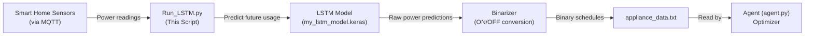
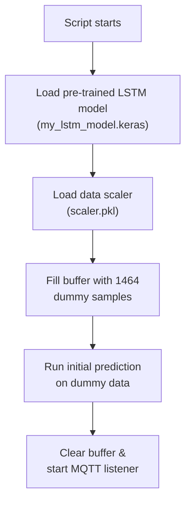
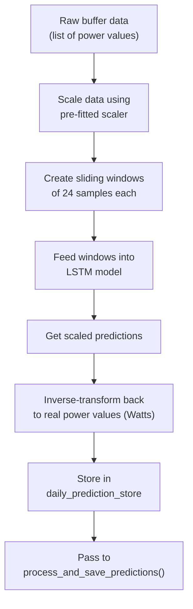
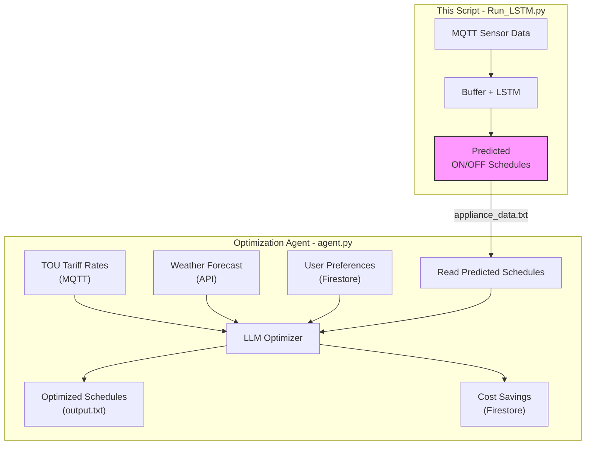

# Run_LSTM.py — LSTM-Based Appliance Power Predictor

## What Does This File Do?

`Run_LSTM.py` is a **real-time energy consumption predictor**. It listens for live power readings from smart home appliances (via MQTT), feeds them into a pre-trained **LSTM (Long Short-Term Memory) neural network**, and predicts the next hour's power usage for each appliance. Those predictions are then converted into simple **ON / OFF schedules** and written to a file that the downstream optimization agent reads.

> **In one sentence:** This script answers the question *"Based on historical patterns, which appliances will the household likely use during each hour of the next 24 hours?"*

---

## High-Level Architecture



---

## The 5 Appliances Tracked

| # | Appliance Name         | Max Power (W) | Typical Usage Pattern           |
|---|------------------------|---------------|---------------------------------|
| 1 | `WashingMachine_Power` | 2500          | 1 session/day, ~2 hours         |
| 2 | `Heater_Power`         | 2000          | 6 short sessions/day, ~30 min   |
| 3 | `AC_Power`             | 3000          | 2 sessions/day, ~5 hours each   |
| 4 | `VehicleCharger_Power` | 3500          | 1 session/day, ~5 hours (night) |
| 5 | `VacuumCleaner_Power`  | 1200          | 3 sessions/day, ~1 hour each    |

---

## Step-by-Step Flow

### Step 1: Startup & Loading



**What happens at startup** (lines 264–271):

1. The LSTM model and its scaler are loaded from disk.
2. The data buffer is pre-filled with **1464 synthetic (dummy) samples** — this is roughly 24 hours of data at 1 sample/minute. This ensures the model has enough historical context to make predictions from the very first moment.
3. An initial prediction is run on this dummy data so that `appliance_data.txt` is populated immediately.
4. The buffer is cleared and the script begins listening for real sensor data via MQTT.

> **Why 1464 samples?** The model uses a sliding window of `seq_length = 24` to make each prediction. Having 1464 samples allows the model to generate ~1440 predictions (one full simulated day), which is exactly 24 hours × 60 minutes.

---

### Step 2: Dummy Data Generation

**Function:** `generate_dummy_sample()` (lines 49–101)

Since the system needs historical data to work but may not have any on a fresh start, this function creates **realistic fake power readings**.

**How it works:**
- It simulates a full day (1440 minutes) for each appliance.
- Each appliance has a usage pattern (e.g., a washing machine runs 1 session of 120 minutes).
- During "ON" minutes, power is **80–100%** of max wattage (e.g., 2000–2500 W for the washing machine).
- During "OFF" minutes, power is a tiny random value (0–5 W), simulating standby draw.
- A static `minute` pointer advances with each call, cycling through the full day.

**Example output (one sample at minute 300 / 5:00 AM):**
```python
# [WashingMachine, Heater, AC, VehicleCharger, VacuumCleaner]
[3.2, 1.8, 2700.5, 3100.0, 4.1]
#  ^OFF   ^OFF    ^ON      ^ON     ^OFF
```

---

### Step 3: Real-Time MQTT Data Ingestion

**Functions:** `on_connect()` (lines 222–227), `on_message()` (lines 229–253), `mqtt_loop()` (lines 255–262)

Once the initial dummy data phase is complete, the script connects to a local **MQTT broker** on `localhost:1883` and subscribes to the topic `home/power`.

**What happens when a message arrives:**

1. The incoming JSON payload is parsed. Each message contains power readings for all 5 appliances:
   ```json
   {
     "WashingMachine_Power": 2350.5,
     "Heater_Power": 0.0,
     "AC_Power": 2800.0,
     "VehicleCharger_Power": 0.0,
     "VacuumCleaner_Power": 950.3
   }
   ```
2. The values are appended to `data_buffer`. The buffer acts as a **circular buffer** — once it reaches 1464 entries, new samples overwrite the oldest ones using `buffer_pointer`.
3. **Every 30 new samples**, a prediction cycle is triggered automatically.

> **Tip:** The circular buffer design ensures constant memory usage regardless of how long the system runs. It always keeps the most recent ~24 hours of data.

---

### Step 4: Running the LSTM Prediction

**Function:** `predict_on_buffer()` (lines 193–220)

This is the core prediction engine. Here is what happens:



**Detailed breakdown:**

1. **Scale the data:** The raw power values are normalized using a pre-fitted `MinMaxScaler` (loaded from `scaler.pkl`) so the LSTM receives values in a consistent range.
2. **Create sliding windows:** The buffer is sliced into overlapping sequences of length 24. Each window of 24 consecutive samples is one input to the LSTM.
3. **Predict:** The model outputs one prediction per window — the expected power for the *next* time step for each appliance.
4. **Inverse-transform:** The predictions are converted back from scaled values to real Watts.
5. **Accumulate:** Predictions are stored in `daily_prediction_store`, which keeps up to the last 1440 predictions (24 hours).

**Example:**
```
Input window (24 samples):  [sample_0, sample_1, ..., sample_23]
LSTM output:                [2400.0, 0.0, 2900.0, 0.0, 1100.0]
                             ^Wash    ^Heat ^AC    ^EV   ^Vacuum
```

---

### Step 5: Converting Predictions to ON/OFF Schedules

**Functions:** `process_and_save_predictions()` (lines 128–190), `binarize_power_values()` (lines 111–125)

This is where raw power predictions become a **24-hour ON/OFF schedule**.

#### 5a. Averaging into Hourly Windows

The ~1440 minute-level predictions are grouped into **24 windows of 60 minutes each**. The average power within each window gives one value per hour:

```
Minutes 0–59    → Hour 0 average:  1200.5 W
Minutes 60–119  → Hour 1 average:    45.2 W
Minutes 120–179 → Hour 2 average:     3.8 W
...
Minutes 1380–1439 → Hour 23 average: 2800.0 W
```

#### 5b. Binarization (ON/OFF Decision)

Each hourly average is compared against a **dynamic threshold**:
- **Threshold** = `threshold_ratio × max(hourly_averages)`
- If the hourly average ≥ threshold → **ON (1)**
- If the hourly average < threshold → **OFF (0)**

The threshold ratio varies by appliance type:

| Appliances                                  | Threshold Ratio | Why                                                         |
|---------------------------------------------|-----------------|-------------------------------------------------------------|
| AC, Heater, Washing Machine                 | **0.6** (60%)   | These have more variable usage, so a lower bar is appropriate |
| Vehicle Charger, Vacuum Cleaner             | **0.8** (80%)   | These have distinct ON/OFF patterns, so a higher bar is used  |

**Example for AC_Power:**
```
Hourly averages: [50, 30, 20, 10, 5, 3, 100, 2800, 2900, 2700, 2500, 2200,
                  1800, 1500, 2000, 2600, 2800, 2900, 3000, 2500, 1000, 200, 80, 40]

Max value = 3000
Threshold = 0.6 × 3000 = 1800

Binary:          [0,  0,  0,  0, 0, 0,  0,    1,    1,    1,    1,    1,
                  1,    0,    1,    1,    1,    1,    1,    1,    0,   0,  0,  0]
```

---

### Step 6: Writing the Output File

The final output is written to `appliance_data.txt` in the project root. This file is what the **optimization agent** (`agent.py`) reads as its input.

**Example output file content:**
```
--- WashingMachine_Power ---
States:
0, 0, 0, 0, 0, 0, 0, 0, 1, 1, 0, 0, 0, 0, 0, 0, 0, 0, 0, 0, 0, 0, 0, 0
Averages:
12.3400, 5.6700, 3.2100, ... (24 float values)
Binary Average States:
0, 0, 0, 0, 0, 0, 0, 0, 1, 1, 0, 0, 0, 0, 0, 0, 0, 0, 0, 0, 0, 0, 0, 0

--- Heater_Power ---
States:
0, 0, 0, 0, 0, 0, 1, 1, 0, 0, 0, 0, 1, 1, 0, 0, 0, 0, 1, 1, 0, 0, 0, 0
Averages:
...
Binary Average States:
...

(... repeated for all 5 appliances ...)
```

Each appliance section contains:
- **States**: The 24-hour binary ON/OFF schedule (the primary output)
- **Averages**: The 24 hourly average power values in Watts
- **Binary Average States**: Same as States (redundant, kept for debugging)

---

## How This Fits Into the Bigger System



| Step | Component | Role |
|------|-----------|------|
| 1 | **Run_LSTM.py** (this file) | Predicts *what the household will likely do* — "The washing machine will probably run at 9 AM and 10 AM" |
| 2 | **agent.py** (optimizer) | Decides *when appliances should actually run* to minimize cost — "Move the washing machine from 9 AM (peak) to 11 PM (off-peak)" |

> **Key insight:** This script generates the **baseline schedule** (what the user *would* do without optimization). The agent then takes this baseline and shifts appliance usage to cheaper time slots while respecting user constraints.

---

## Key Configuration Constants

| Constant | Value | Meaning |
|----------|-------|---------|
| `seq_length` | `24` | Number of consecutive samples the LSTM needs as input |
| `initial_fill_samples` | `1464` | Dummy samples to bootstrap the buffer (~24h of minute data) |
| `max_buffer_size` | `1464` | Maximum samples kept in the circular buffer |
| `broker` | `localhost` | MQTT broker address |
| `port` | `1883` | MQTT broker port |
| `topic` | `home/power` | MQTT topic for power readings |

---

## Summary

| Question | Answer |
|----------|--------|
| **What goes in?** | Real-time power readings from 5 appliances (via MQTT) |
| **What comes out?** | A 24-hour ON/OFF schedule per appliance (written to `appliance_data.txt`) |
| **What model is used?** | A pre-trained LSTM neural network (`my_lstm_model.keras`) |
| **How often does it predict?** | Every 30 new sensor readings |
| **What if there's no data at startup?** | It generates realistic dummy data to bootstrap predictions |
| **Who consumes the output?** | The optimization agent (`agent.py`) reads it as input |
