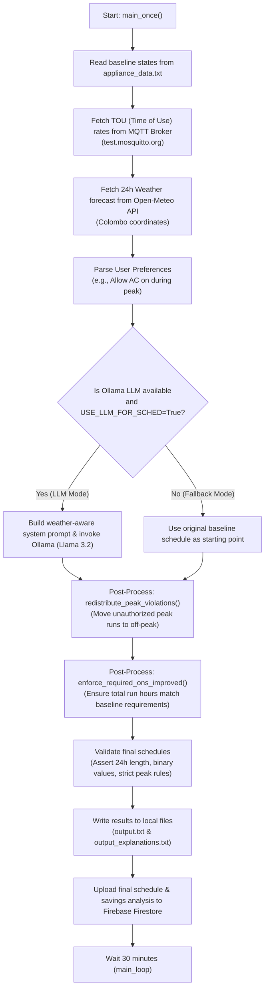

# Explanatory Guide: Edge Controller Energy Optimization Agent (`agent.py`)

This document provides a comprehensive, step-by-step explanation of the [agent.py](file:///d:/Research/Code/AI-Based-Optimized-Energy-Utilization-system-Using-Edge-Controllers/src/agent/agent.py) codebase. The agent coordinates real-time data ingestion, local Large Language Model (LLM) reasoning, constraint validation, and Firebase updates to dynamically optimize household energy schedules.

---

## 1. Overall System Architecture & Workflow

Below is the conceptual flow of the agent when running a single optimization loop (`main_once`):



---

## 2. Block-by-Block Code Walkthrough

### 2.1 Imports & Configuration (Lines 1–21)
```python
import paho.mqtt.client as mqtt
import time
import ast
import json
from langchain_ollama import ChatOllama
import ollama
from datetime import datetime, timedelta
import re
from typing import Dict, List, Tuple
import requests
from datetime import datetime
import os
from zoneinfo import ZoneInfo
```
* **Purpose:** Sets up core dependencies:
  * `paho.mqtt` for connecting to the MQTT broker.
  * `langchain_ollama` and `ollama` for interacting with local LLMs.
  * `requests` for making HTTP calls to weather APIs.
  * `ZoneInfo` for time-zone calculations (Colombo).

```python
MQTT_BROKER = "test.mosquitto.org"
MQTT_PORT = 1883
MQTT_TOPIC = "power/tou_domestic"
```
* **Purpose:** Defines the public MQTT broker, port, and topic used to fetch Time-of-Use (TOU) electricity pricing information.

---

### 2.2 Firebase Initialization (Lines 22–43)
```python
db = None
try:
    import firebase_admin
    from firebase_admin import credentials, firestore

    base_dir = os.path.dirname(os.path.abspath(__file__))
    key_path = os.path.abspath(os.path.join(base_dir, '..', '..', 'serviceAccountKey.json'))

    if os.path.exists(key_path):
        cred = credentials.Certificate(key_path)
        firebase_admin.initialize_app(cred)
        print(f"Firebase initialized successfully using key: {key_path}")
    else:
        firebase_admin.initialize_app()
        print("Firebase initialized using default credentials.")
    db = firestore.client()
except Exception as e:
    print(f"Firebase initialization skipped/failed: {e}")
```
* **Purpose:** Locates `serviceAccountKey.json` to authenticate with Firebase Admin SDK and initializes a Firestore database connection (`db`) to log the output schedules and savings. If no credentials file is found, it attempts to load default credentials or skips initialization.

---

### 2.3 Appliance Constants (Lines 44–66)
```python
APPLIANCES = [
    'WashingMachine_Power',
    'Heater_Power',
    'AC_Power',
    'VehicleCharger_Power',
    'VacuumCleaner_Power'
]

POWER_KWH: Dict[str, float] = {
    'WashingMachine_Power': 0.6,   # kWh per ON hour
    'Heater_Power':         2.0,
    'AC_Power':             1.2,
    'VehicleCharger_Power': 2.2,
    'VacuumCleaner_Power':  1.1,
}

USE_LLM_FOR_SCHED = True
LLM_MODEL = "llama3.2:latest"  # local Ollama model tag
LLM_TEMP = 0.0
```
* **`APPLIANCES`**: The list of devices the system is optimizing.
* **`POWER_KWH`**: Specifies the average hourly energy consumption (in Kilowatt-hours) when each appliance is turned ON.
* **`USE_LLM_FOR_SCHED`**: Flag to toggle between utilizing Llama 3.2 for scheduling or relying purely on rule-based heuristics.

---

### 2.4 Weather Integration (Lines 67–114)
```python
def fetch_weather_24h(lat: float, lon: float, tz: str = "Asia/Colombo"):
    url = (
        "https://api.open-meteo.com/v1/forecast"
        f"?latitude={lat}&longitude={lon}"
        "&hourly=temperature_2m,relative_humidity_2m"
        "&forecast_days=2"   
        f"&timezone={tz}"
    )
    resp = requests.get(url, timeout=10)
    resp.raise_for_status()
    data = resp.json()
    ...
```
* **Purpose:** Queries the free Open-Meteo API for a 48-hour forecast of temperature and relative humidity at the designated latitude/longitude (Colombo, Sri Lanka).
* **Hour Matching:** It checks the current local hour (e.g., `15:00`) and slices the next 24 consecutive hours of forecast data so that weather indexes align perfectly with our 24-hour scheduling array.

---

### 2.5 MQTT Data Retrieval (Lines 115–161)
```python
def get_mqtt_power_data(timeout: int = 5):
    result: Dict[str, str] = {}
    try:
        client = mqtt.Client(callback_api_version=mqtt.CallbackAPIVersion.v5)
        def on_connect(client, userdata, flags, reason_code, properties):
            if reason_code == 0:
                client.subscribe(MQTT_TOPIC)
            ...
```
* **Purpose:** Subscribes to `power/tou_domestic` on the MQTT broker and blocks for up to `timeout` seconds to wait for a single JSON payload containing day, peak, and off-peak tariffs. Once received, it stores the message in `result['payload']` and disconnects.

---

### 2.6 Reading Appliance Status File (Lines 162–188)
```python
def read_appliance_status(filename: str) -> Dict[str, Dict[str, List[int]]]:
    ...
```
* **Purpose:** Reads `appliance_data.txt`, which contains the baseline/predicted 24-hour schedules. The format expected is:
  ```txt
  --- WashingMachine_Power ---
  States:
  0,0,0,1,1,0,... (24 binary integer values)
  ```
  It parses the file line-by-line and extracts a dictionary mapping each appliance to its starting binary schedule.

---

### 2.7 Utility Functions (Lines 189–244)
* **`parse_price_num(val)`**: Regular expression utility to extract floats from strings like `"LKR 54.00"`.
* **`fix_length(arr)`**: Ensures that the binary list for any appliance is exactly 24 elements long (truncating or padding with `0`s if necessary) and clamps values to `0` or `1`.
* **`time_range_to_hours(start_time, end_time)`**: Converts a time range (e.g., `"18:30 - 22:30"`) into an array of hour indices (e.g., `[18, 19, 20, 21]`). It supports overnight hour wraps (e.g., `22:30 - 05:30` becomes `[22, 23, 0, 1, 2, 3, 4]`).
* **`extract_first_array(text)`**: A regex parser that extracts a Python list structure `[...]` from the raw LLM output, discarding markdown formatting.

---

### 2.8 Price Mapping & Cost Calculations (Lines 245–338)
* **`build_price_map(tou_json)`**: Generates a dictionary lookup structure for the 24 hours of the day. For each hour `0` through `23`, it returns the specific price and the name of the band (e.g., `{18: {"price": 67.0, "band": "peak"}}`).
* **`cost_for_states(states, power_kwh, price_map)`**: Calculates total cost by summing:
  $$\text{Cost} = \sum_{h=0}^{23} (\text{State}_h \times \text{Power\_kWh} \times \text{Price}_h)$$
* **`compare_and_pair_moves(orig, opt)`**: Greedily pairs an hour that was turned OFF in the optimized schedule with an hour that was turned ON. This helps explain *where* energy consumption was shifted (e.g. "Moved hour 18:00 to 23:00").
* **`explain_changes(appliance, orig, opt, price_map, power_kwh)`**: Compiles human-readable reasoning (e.g., `"Shifted hour 19:00 (peak) -> 23:00 (off_peak)"`) and calculates total savings.

---

### 2.9 Hard Constraint Post-Processing (Lines 339–421)

Even if an LLM is used, it may make mistakes. The agent applies two deterministic rules to enforce constraints:

#### `redistribute_peak_violations`
```python
def redistribute_peak_violations(schedules, tou_json, allow_peak):
    ...
```
* If the user **does not allow** peak hours for an appliance, this function sweeps through all hours within the peak period. If it finds any `1`s (ON), it resets them to `0` (OFF) and shifts them to the cheapest available non-peak hours (prioritizing off-peak, then day).

#### `enforce_required_ons_improved`
```python
def enforce_required_ons_improved(schedules, tou_json, required_ons, allow_peak):
    ...
```
* Ensures that the **total number of ON hours remains constant** relative to the original schedule. If the optimization phase accidentally added or deleted runs, this function corrects it by adding missing `1`s (first to off-peak, then day) or removing excess `1`s (first from day, then off-peak) until the count matches exactly.

---

### 2.10 Weather-Aware LLM System Prompts (Lines 422–496)
```python
def build_system_prompt(APPLIANCES, status, tou_json, weather, i, allow_peak):
    ...
```
* **Purpose:** Generates a personalized prompt instructing the LLM on how to optimize scheduling. It uses weather rules to maintain user comfort:
  * **Air Conditioner (AC_Power):** If the forecasted outdoor temperature is $\ge 28^\circ\text{C}$ or humidity $\ge 80\%$, these hours are classified as `hot_hours`. The LLM is instructed to prioritize keeping the AC ON during these hot hours (or adjacent off-peak hours if peak runs are prohibited).
  * **Heater (Heater_Power):** If the forecasted temperature is $\le 20^\circ\text{C}$ (`cold_hours`), the LLM is instructed to prioritize heating during these cold periods.
  * **Other Appliances:** Ignored by weather conditions; optimized solely based on electricity price.

---

### 2.11 Output Writers & Preferences (Lines 497–556)
* **`write_schedules(schedules)`**: Writes the optimized binary schedule for all appliances to `output.txt`.
* **`write_explanations(explanations, currency)`**: Writes the cost analysis, total savings, and rationales to `output_explanations.txt`.
* **`parse_user_preferences(user_msg)`**: Scans user commands (e.g., *"Allow AC_Power ON during peak hours"*) to dynamically toggle the peak override rules.

---

### 2.12 Main Scheduling loop (Lines 557–730)
```python
def main_once():
    # 1. Read appliance baseline data
    # 2. Grab tariff rates via MQTT
    # 3. Retrieve Open-Meteo weather
    # 4. Parse user preference rules
    # 5. Call Ollama (Llama 3.2) or fall back to Rule-Based
    # 6. Apply post-process rule constraints (redistribution, total runtime)
    # 7. Validate results (length=24, binary only)
    # 8. Save output.txt and output_explanations.txt
    # 9. Upload schedules and calculations to Firestore
```
* **`main_once()`**: Coordinates the sequence of events shown in the diagram.
* **`main_loop()`**: Enters an infinite loop executing `main_once()`, then sleeping for 30 minutes before triggering the next cycle.
