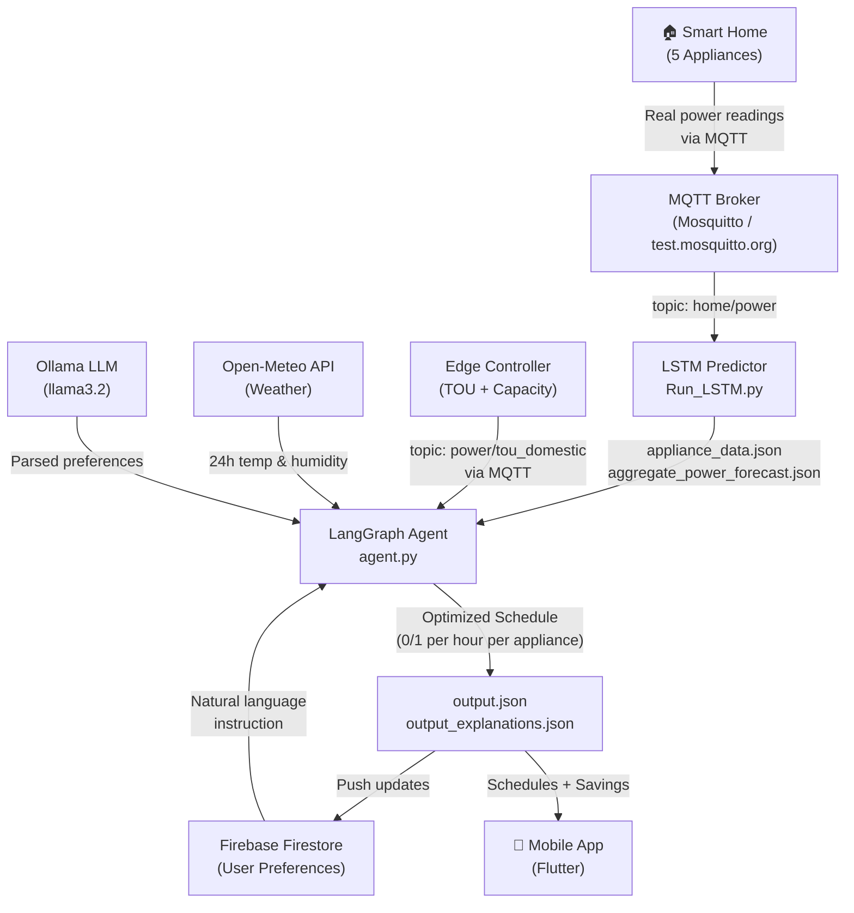

# AI-Based Optimized Energy Utilization System — Research Flow

## What This Research Is About

This system is an **AI-driven Smart Home Energy Management System (HEMS)** for Sri Lanka (using LECO tariffs).  
It automatically decides **which home appliances should run at which hours of the day** to minimize electricity cost while respecting grid capacity, user preferences, and occupant comfort.

---

## System Architecture Overview



---

## Step-by-Step Flow

### 🔵 PHASE 1 — Sensor Data Simulation & Ingestion

**File:** [`publish_dummy_sensor.py`](file:///d:/Research/Code/AI-Based-Optimized-Energy-Utilization-system-Using-Edge-Controllers/src/mqtt/publish_dummy_sensor.py)

1. Since real IoT sensors may not always be available, a **dummy sensor publisher** simulates 5 home appliances:
   - WashingMachine, Heater, AC, VehicleCharger, VacuumCleaner
2. Every **60 seconds**, it publishes random but realistic power readings (in Watts) as a JSON message to the MQTT broker on topic `home/power`.
3. This represents the edge sensor layer of the system.

---

### 🟣 PHASE 2 — LSTM-Based Power Forecasting

**File:** [`Run_LSTM.py`](file:///d:/Research/Code/AI-Based-Optimized-Energy-Utilization-system-Using-Edge-Controllers/src/predictor/Run_LSTM.py)

4. The LSTM predictor **subscribes to** the `home/power` MQTT topic and collects incoming sensor readings into a rolling buffer (max 1464 samples ≈ 24 hours at 1 msg/min).
5. On startup, the buffer is pre-filled with **1464 dummy samples** to ensure there's enough historical data immediately.
6. Every **30 new MQTT messages**, it runs the trained LSTM model to predict the next power values for all 5 appliances simultaneously.
7. The LSTM model (pre-trained on `appliance_power_data.csv`) takes a **24-step sequence** as input and predicts the next power reading.
8. Predictions are accumulated into a **1440-sample daily store** (1 per minute × 1440 min/day).
9. The `process_and_save_predictions()` function then:
   - Divides the day into **24 one-hour windows** (60 samples each)
   - Averages predictions per window to get **hourly average power** for each appliance
   - Converts averages to **binary ON/OFF states** using `binarize_by_demand()`:
     - Total predicted energy (Wh) ÷ Rated power (W) = Required ON hours
     - Top N hours with highest predicted power → marked as ON (1)
10. Saves two JSON files:
    - **`appliance_data.json`** — per-appliance states, averages, and binary states for 24 hours
    - **`aggregate_power_forecast.json`** — sum of all appliance power per hour

---

### 🟡 PHASE 3 — TOU Tariff & Capacity Data (Edge Controller via MQTT)

**File:** [`publish_tou_test.py`](file:///d:/Research/Code/AI-Based-Optimized-Energy-Utilization-system-Using-Edge-Controllers/src/mqtt/publish_tou_test.py)

11. A separate MQTT publisher sends **Time-of-Use (TOU) pricing and grid capacity data** to the topic `power/tou_domestic`.
12. This message contains:
    - **3 TOU bands** with time ranges, electricity rates (LKR/kWh), and capacity limits (kW):
      - 🟢 Off-Peak (00:00–05:00, 22:00–24:00) — cheapest
      - 🟡 Day (05:00–18:00) — medium
      - 🔴 Peak (18:00–22:00) — most expensive (up to 106 LKR/kWh)
    - This simulates the **Edge Controller** sending real-time grid pricing signals.

---

### 🟠 PHASE 4 — LangGraph AI Agent Decision Loop

**File:** [`agent.py`](file:///d:/Research/Code/AI-Based-Optimized-Energy-Utilization-system-Using-Edge-Controllers/src/agent/agent.py)

The Agent is built using **LangGraph** (a state-machine workflow framework) and runs every **30 minutes**. It has 5 nodes:

#### Node 1: `fetch_data_node` — Data Collection
13. Reads **`appliance_data.json`** → gets required ON hours and original predicted states per appliance.
14. Reads **`aggregate_power_forecast.json`** → total hourly load forecast.
15. Connects to MQTT and waits up to 15 seconds for the **TOU+Capacity** payload → builds a `price_map` (hourly prices + band labels).
16. Calls **Open-Meteo API** → fetches real 24-hour temperature & humidity forecast for **Colombo, Sri Lanka**.
17. Reads **Firebase Firestore** → fetches user's latest natural-language instruction (e.g., *"Allow AC_Power ON during peak hours"*).

#### Node 2: `parse_preferences_node` — LLM Preference Parsing
18. Sends the user's instruction to the **local Ollama LLM** (`llama3.2`) with a structured prompt.
19. The LLM returns a JSON object specifying:
    - **`allow_peak`**: Which appliances are allowed to run during peak hours (true/false per appliance)
    - **`preferred_hours`**: Any specific hour slots the user wants (e.g., "run washing machine before 10 AM" → hours [0–9])
20. If Ollama is unavailable, defaults to: no peak access allowed, no time restrictions.

#### Node 3: `schedule_allocation_node` — MILP Optimization

**File:** [`benchmark.py`](file:///d:/Research/Code/AI-Based-Optimized-Energy-Utilization-system-Using-Edge-Controllers/src/agent/benchmark.py)

21. Calls the **Mixed-Integer Linear Programming (MILP)** solver (`scipy.optimize.milp`) to find the optimal schedule.
22. **Decision variables**: Binary ON/OFF for each appliance × each hour = 5 × 24 = **120 binary variables** + 24 slack variables for soft capacity constraints.
23. **Objective function** (minimize total cost):
    - `Σ (appliance power rating × hourly price × ON/OFF state)`
    - AC/Heater get a **comfort bias** (−100 score) on hot/cold hours → strongly prefer scheduling them during comfort-critical hours even if slightly costlier
24. **Hard constraints**:
    - Each appliance must run exactly its **required number of hours** (derived from LSTM prediction)
    - Appliances can't exceed **grid capacity per hour** (soft, with penalty slack variables)
    - User-blocked peak hours → set variable upper bound to 0
    - User-preferred time windows → restrict available slots
25. The MILP solver returns the globally optimal binary schedule.

#### Node 4: `write_results_node` — Output & Reporting
26. Writes **`output.json`** — the final optimized hourly ON/OFF schedule for all 5 appliances.
27. Calculates and writes **`output_explanations.json`**:
    - Per-appliance: original cost vs. optimized cost, savings, human-readable reasons for each schedule change
    - Totals: baseline cost, optimized cost, total savings, % savings
    - Embeds weather data and user preferences for traceability
28. Pushes updates to **Firebase Firestore**:
    - `analysis/latest` — cost breakdown per appliance
    - `schedules/latest` — final ON/OFF schedule per appliance

#### Fallback Node: `fallback_revert_node`
29. If any critical error occurs (MQTT timeout, MILP failure, etc.), the system **reverts to the raw LSTM-predicted states** (unoptimized) as a safe fallback.

---

### 🟢 PHASE 5 — Mobile App Visualization

**Folder:** [`mobile-app/`](file:///d:/Research/Code/AI-Based-Optimized-Energy-Utilization-system-Using-Edge-Controllers/mobile-app)

30. A **Flutter mobile app** reads from Firebase Firestore in real-time.
31. Displays the optimized schedules, cost savings per appliance, and allows the user to submit new preferences (natural language instructions that feed back into Step 17).

---

## Complete Data Flow Summary

```
Sensors → MQTT → LSTM Prediction → appliance_data.json
Edge Controller → MQTT → TOU Pricing
Open-Meteo API → Weather Data
Firebase → User Preferences → Ollama LLM → Parsed Rules
                                              ↓
                             MILP Optimizer (LangGraph Agent)
                                              ↓
                         output.json + output_explanations.json
                                              ↓
                          Firebase Firestore → Mobile App
```

---

## Key Technologies Used

| Component | Technology |
|---|---|
| Sensor Data | MQTT (Mosquitto / paho-mqtt) |
| Power Forecasting | LSTM (TensorFlow/Keras) |
| AI Agent Workflow | LangGraph (StateGraph) |
| Schedule Optimization | MILP (scipy.optimize.milp) |
| LLM for NLP | Ollama (llama3.2) locally |
| Weather | Open-Meteo Free API |
| Cloud Storage | Google Firebase Firestore |
| Mobile UI | Flutter |
| Tariff Reference | LECO Sri Lanka TOU (2024) |

---

## The 5 Appliances Managed

| Appliance | Rated Power | Key Constraint |
|---|---|---|
| WashingMachine | 0.6 kW | Flexible, prefer off-peak |
| Heater | 2.0 kW | Prefer cold hours (comfort) |
| AC | 1.2 kW | Prefer hot/humid hours (comfort) |
| VehicleCharger | 2.2 kW | Prefer overnight (off-peak) |
| VacuumCleaner | 1.1 kW | Flexible, minimize cost |
